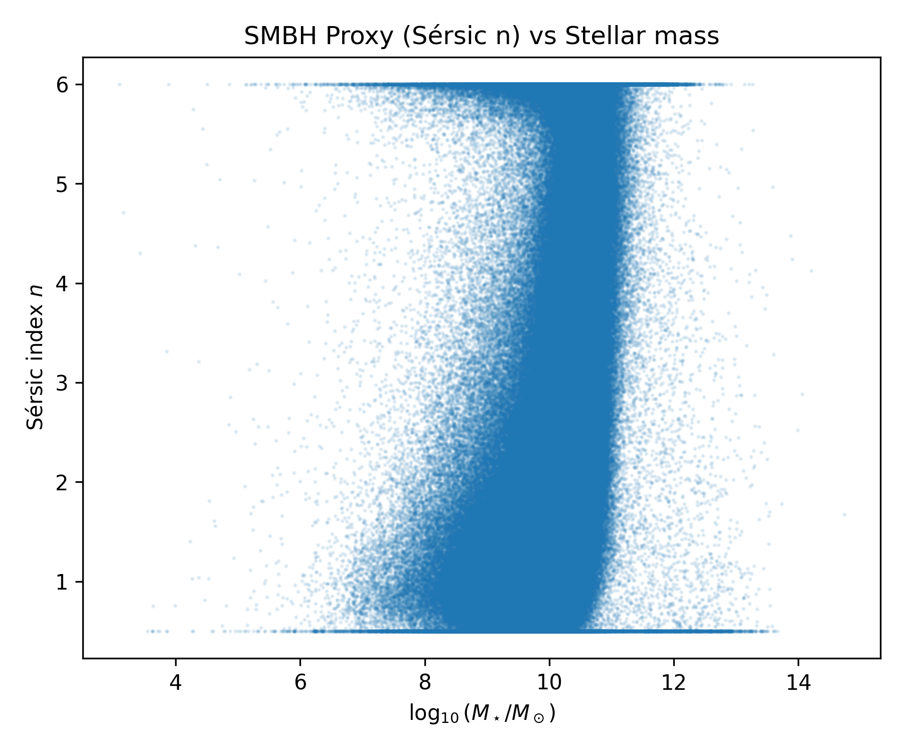
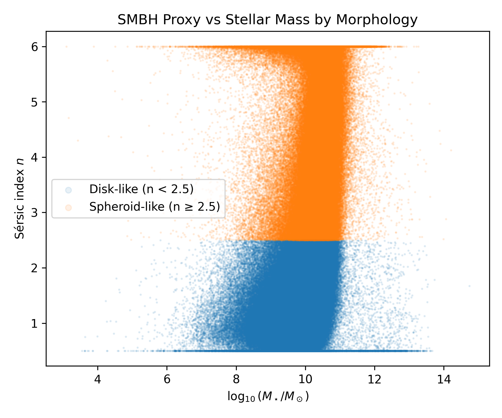
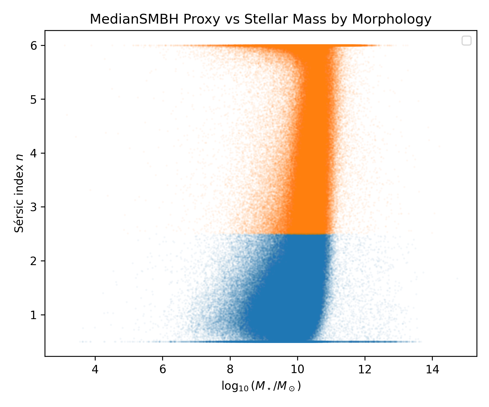

# SMBH–Host Galaxy Scaling Relations

**SMBH–host galaxy scaling relations are not universal — they emerge primarily in bulge-dominated systems, while disk-dominated galaxies follow a structurally distinct evolutionary path.**

This repository presents an observational analysis of supermassive black hole (SMBH) proxy behaviour across morphologically distinct galaxy populations using NASA–Sloan Atlas (NSA) data. The central finding is that galaxy structure, not stellar mass alone, is the primary organising parameter of SMBH–host scaling relations.

---

## Key Results

- Disk-dominated galaxies (n < 2.5) maintain low Sérsic index across a wide stellar mass range — consistent with inefficient bulge and SMBH growth
- Spheroid-dominated galaxies (n ≥ 2.5) show a clear increase in Sérsic index with stellar mass and significantly reduced scatter
- The large scatter in global SMBH proxy relations is largely a consequence of mixing these two structurally distinct populations
- Morphology-dependent median trends reveal two internally coherent regimes hidden in the global relation

---

## Figures



*Global distribution of Sérsic index vs stellar mass. The broad scatter reflects the superposition of structurally distinct populations.*



*Separating disk-dominated (n < 2.5) and spheroid-dominated (n ≥ 2.5) galaxies reveals two clearly distinct regimes in SMBH proxy behaviour.*



*Binned median Sérsic index vs stellar mass by morphology. Spheroid-dominated systems show a systematic increase; disk-dominated systems remain approximately flat.*

---

## Scientific Motivation

Direct SMBH masses are unavailable for most galaxies in large photometric surveys. The Sérsic index (n) serves as a structural proxy for bulge dominance, which is empirically linked to SMBH growth through the M–sigma and related scaling relations.

This analysis asks:

> Is the SMBH–host galaxy scaling relation universal, or does it depend on host morphology?

The results demonstrate that it is not universal — and that morphological structure is the key organising variable.

---

## Dataset

**Source:** NASA–Sloan Atlas (NSA)  
**SMBH proxy:** Sérsic index (n) — structural proxy for bulge dominance  
**Host property:** Stellar mass (M\*; Sérsic-based, log-transformed)

Quality cuts applied:

- Finite, positive Sérsic index
- Finite, positive stellar mass

Morphological classification:

- Disk-dominated: n < 2.5
- Spheroid-dominated: n ≥ 2.5

---

## Methodology

- FITS ingestion via Astropy
- Quality filtering on Sérsic index and stellar mass
- Morphological split at n = 2.5
- Binned median trends computed in stellar mass bins of width 0.25 dex
- Minimum 10 galaxies per bin required for median computation
- Redshift distribution verified as a sanity check against distance-related systematics

---

## Interpretation

The global SMBH proxy relation shows broad scatter across all stellar masses. Once galaxies are separated by morphology:

1. **Disk-dominated systems** occupy a nearly horizontal band — even massive disks retain low Sérsic index, implying weak bulge growth and inefficient SMBH growth across the mass range.
2. **Spheroid-dominated systems** show a systematic rise in Sérsic index with stellar mass and significantly tighter internal scatter — this population drives the classical scaling relations reported in the literature.

The commonly observed global SMBH–host scaling relation is therefore not a fundamental single-population trend, but arises from the superposition of two structurally distinct evolutionary channels.

---

## Reproducibility

```bash
pip install -r requirements.txt
python scripts/explore_nsa_smbh.py
```

Raw NSA FITS data is not version-controlled. Place the file in `data/` before running.

---

## Repository Structure

```
SMBH-host-galaxy-scaling/
│
├── README.md
├── requirements.txt
├── scripts/
│   └── explore_nsa_smbh.py
├── figures/
│   ├── sersic_n_vs_mass.png
│   ├── sersic_n_vs_mass_morphology.png
│   └── sersic_n_vs_mass_medians.png
└── data/  (not version-controlled)
```

---

## Project Philosophy

This repository presents an exploratory but structurally rigorous observational study. The emphasis is on physically interpretable results and honest representation of what the data shows, rather than overfitting a narrative to limited proxies.

---

## Author

Gnaneshwar G S  
Computational galaxy evolution | Structural scaling relations | Statistical modeling in large survey datasets
